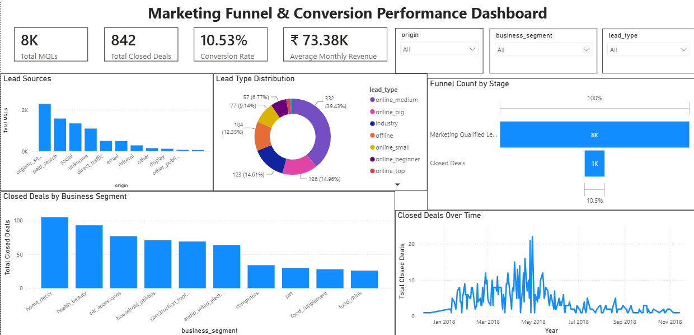

# 📊 Marketing Funnel & Conversion Performance Analysis

## 📌 Project Overview

This project analyzes a marketing funnel to understand how marketing-qualified leads (MQLs) convert into closed deals. Using Power BI, the dashboard identifies conversion performance, lead source effectiveness, business segment trends, and revenue insights to support data-driven marketing decisions.

---

## 🎯 Objectives

* Analyze the marketing funnel and lead conversion process.
* Measure lead-to-customer conversion rates.
* Identify high-performing lead sources.
* Compare business segment performance.
* Visualize revenue and conversion trends.
* Provide actionable recommendations to improve marketing performance.

---

## 🛠️ Tools & Technologies Used

* 📊 Power BI
* 🔄 Power Query
* 📈 DAX (Data Analysis Expressions)
* 📄 CSV Dataset

---

## 📂 Dataset

The project uses the **Olist Marketing Funnel Dataset**, which includes:

* Marketing Qualified Leads (MQLs)
* Closed Deals
* Lead Sources
* Business Segments
* Revenue Information

---

## 📊 Dashboard Preview



---

## 📈 Dashboard Features

* KPI Cards

  * Total Marketing Qualified Leads
  * Total Closed Deals
  * Conversion Rate
  * Average Monthly Revenue
* Lead Source Analysis
* Business Segment Performance
* Lead Type Distribution
* Closed Deals Trend Analysis
* Interactive Slicers for Data Exploration

---

## 🔍 Key Insights

* Approximately **10.53%** of marketing-qualified leads converted into closed deals.
* Lead generation varies significantly across different marketing origins.
* Some business segments consistently achieve higher conversion volumes.
* Customer revenue varies considerably across converted deals.
* Conversion performance changes over time, highlighting opportunities for campaign optimization.

For a detailed analysis, see **INSIGHTS.md**.

---

## 💡 Recommendations

* Invest more in high-performing lead acquisition channels.
* Improve lead nurturing strategies to increase conversion rates.
* Focus marketing efforts on high-converting business segments.
* Monitor funnel performance regularly to identify optimization opportunities.
* Use data-driven insights to improve future marketing campaigns.

---

## 📁 Repository Structure

```text
FUTURE_DS_03/
│
├── dataset/
│   ├── olist_marketing_qualified_leads_dataset.csv
│   └── olist_closed_deals_dataset.csv
│
├── dashboard/
│   ├── Marketing_Funnel_Conversion_Dashboard.pbix
│   └── dashboard.png
│
├── README.md
└── INSIGHTS.md
```

---

## 🚀 Conclusion

This project demonstrates the use of Power BI for marketing funnel analysis, conversion tracking, and business intelligence. The interactive dashboard helps identify conversion trends, evaluate lead quality, and support strategic marketing decisions through data-driven insights.
